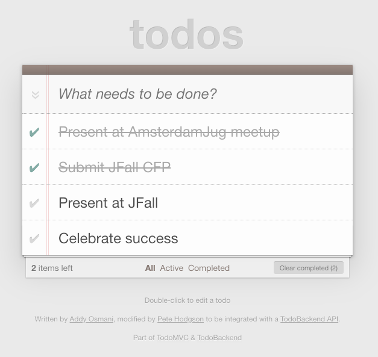

Example client that reads Json contents from a `java.io.InputStream`
and wraps the result into a `java.util.stream.Stream` instance.

# Usage

**Given** the following Todo list:



**When** the following code is run:

```java
TodoResource todoResource = new TodoResource("http://localhost:8080/todos");

Stream<Todo> stream = todoResource.stream();

try(stream) {
    stream.filter(Predicate.not(Todo::isCompleted)).forEach(System.out::println);
}
```

**Then** the following output is produced:

```
Todo{title='Present at JFall', completed=false, order=3}
Todo{title='Celebrate success', completed=false, order=4}
```

# Dependencies

* https://www.todobackend.com/
* https://github.com/TodoBackend/todo-backend-client
